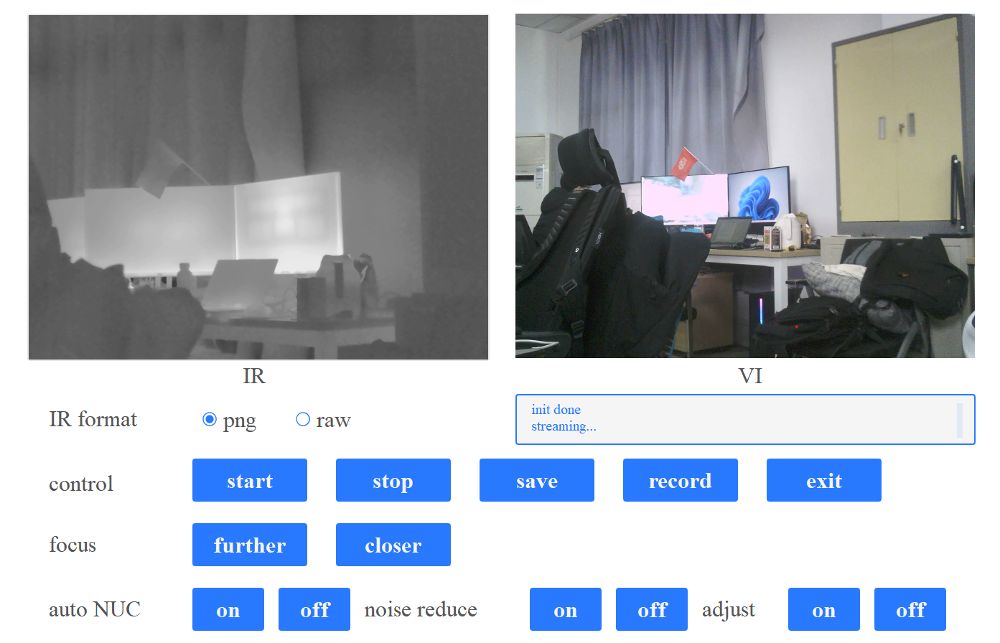

## FLIR A700 dual camera image capture program
1. infrared and visible dual streaming  
2. display and save images  

### requirement
#### windows software
[FLIR ipconfig3](https://flir.custhelp.com/app/account/fl_download_software)  
[spinnaker 3.1](https://www.flir.com/support-center/iis/machine-vision/downloads/spinnaker-sdk-download/spinnaker-sdk--download-files/)  
[Bonjour](https://flir.custhelp.com/app/answers/detail/a_id/3050/related/1/session/L2F2LzEvdGltZS8xNjk0OTk5MzA5L2dlbi8xNjk0OTk5MzA5L3NpZC9mVU5xaWNWcG1tV1RRU2JZVDI2MEJPZjZDMGJRT3ZOT04wRHIlN0Vyam5hYVEyT3NzRWdYZHZ6b0xGTlFEWERpVDR5QTBvM2l3NUlfQ0c1YV84ek1JNlE5alVXY0ZCVlJYeWRfYXdxeHFHc3gxbHYlN0VyZ2lfaGphS19RJTIxJTIx)  
[ffmpeg](http://ffmpeg.p2hp.com/download.html)  
[QT5.12](https://www.qt.io/product/development-tools)  

#### python environment
python 3.7  
PyQt5  5.15.2  
pyqt5-tools  
[qt-material](https://github.com/UN-GCPDS/qt-material)  
[spinnaker-python](https://www.flir.com/support-center/iis/machine-vision/downloads/spinnaker-sdk-download/spinnaker-sdk--download-files/)  
pyinstaller  

### run 
#### FLIR configuration
use `FLIR ipconfig3` to configure ip settings  
if you have any trouble, try `AdapterConfigGUI` and `SpinView` to fix, which are installed along with spinnaker3.1  

#### run in python
change the rtps adress in run_demo.py  
the default adress is rtsp://192.168.0.1/mjpg/ch1  
`python run_demo.py`  

#### build exe
`pyinstaller -F --add-data "custom.css;." --add-data "mask.png;." --add-data "white_mask.png;." --add-data "my_demo.ico;." run_demo.py --hidden-import demo_ui.py --icon=my_demo.ico`  
click run_demo.exe

### other 
1. `IR format`: cannot change while streaming  
2. `control`: start, stop and save. 
   press `save` button to save infrared and visible images. press `record` button to save infrared image sequence  
3. the .raw file can be read using `readraw.m`, which is matlab code. Or use my [raw-reader](https://github.com/frostcza/raw-reader)  

